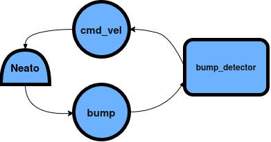

# RoboBehaviors and Finite State Machines Project
## Wynona Brinkmann, Rohan Bendapudi, and Darian Jimenez
## For Olin ENGR3590 Computational Introduction to Robotics

### Project Overview and Learning Objectives
This project serves as an introduction to ROS2 which we will use for the remainder of the semester. Our key learning objective revolved around learning to interface and debug issues between nodes, topics, subscribers, and publishers. We started by implementing a simple behavior: driving the neato in an arch. Then we implemented a bump detector, which can e-stop and back-up. And lastly, we created a people follower node, which will follow objects in a LIDAR scan. To meet our learning objectives, and the project requirements - we finally combined all of these behaviors under one Finite State Machine controller. For this project, we primarily utilized LIDAR and bumper sensors on the Neato. We have included a full outline of our project in the following sections and a quickstart guide at the end. 

### Behaviors
#### Behavior 1: Drive in a Circle (drive_arch.py)
_Method and Relevant Code Structure:_
The intent for this behavior is for the Neato to drive in a circle. When the FSM sets the state to the arch behavior, the Neato will drive at a constant linear and angular velocity. This node publishes to the cmd_vel topic at a 10 Hz rate – with a linear velocity of 0.5 m/s and pi/3 rad/s. 

Diagram:
.png)

#### Behavior 2: Bump Detector (bump_detectory.py)
_Method and Relevant Code Structure:_
This behavior is intended to e-stop and redirect the robot during a collision. To enable this behavior, our bump_detect_node subscribes to the Bump topic. When the Neato bumper collides into an object, the e-stop behavior is activated whereby for 5 seconds, the Neato stops, backs up, and starts driving forward. Throughout this e-stop behavior, the node will publish the appropriate velocities to the cmd_vel topic. 



Within the context of the Finite State Machine, the Bump Detector also publishes a bumped_reversing as a Bool message type. While the Neato collides, e-stops, and reverses, the Bump Detector will publish this state as True – which the Finite State Machine will use to switch the FSM states between nodes. Once the Neato fully reverses, the Bump Detector will publish the bumped_reversing as false. In addition, this integration also removes the post-Bump behavior where the Neato will drive forward. We will discuss the FSM integration in further detail in a later section:

.png)

#### Behavior 3: People Follower (people_follower.py)

Behavior 3: People Follower (people_follower.py)
Method and Relevant Code Structure:
This behavior is intended to detect and follow a nearby person/object using the LiDAR built into the Neato. To enable this behavior, the people_follow_node subscribes to the /scan topic, then storing the most recent LiDAR measurements. If there is no target, it will find the closest object in the scan and save its location under target_index. As it continues scanning, in order to stay locked on the object it chose, instead of searching the entire entire environment again, it only searches in a small range around the most recent target_index. 

To prevent the robot getting confused if the object is lost/deleted, we only set found_following_target to true if the object is within 2 meters. If its not, we set it to false and the object is lost. 

Once a target is found, the index gets converted to a left/right direction and when the FSM puts the robot in state 3, the follower uses that direction to set the angular velocity, publishing the movement command to /cmd_vel. In the FSM, the follower also published the /found_following_state as a boolean, so when it’s set to false, it will switch from state 3 into another state. 

## Finite State Machine
### Combining the Behaviors - Finite State Controllers

Finite State Machine
Combining the Behaviors - Finite State Controller
Method and Relevant Code Structure:
To combine the behaviors together, we integrated a finite state controller which transitions between different behavior states. The finite state controller publishes a /state topic to the three nodes: drive_arch, bump_detector, and people_follow. If the value of the /state corresponds to a specific node, that specified node activates and starts running – deactivating any other running node. 

The finite state controller node also subscribes to two topics /bumped_reversing (published from bump_detector node) and found_following_target (published from people_follow node). The bumped_reversing topic will be set to True when the Neato bumps into an object or reverses from it. And the /found_following_target topic will be set to True when the Neato finds an object within a 1 meter radius. Based on these two topics, the finite state control will decide which behavior node to set active. 

If only /bumped_reversing is set to True by the bump_detector node, the FSM will publish /state as 2 – which will set the bumped_detector node as the active node. If only /found_following_target is set to True by the people_follow node, the FSM will publish /state as 3, setting the people_follow node as the active node. In the case that both /bumped_reversing and /found_following_target are true, the bump_detector node will take precedence and be set to active. We made this design choice because placing high priority for the people_follow node could nullify the bump_detector’s e-stop behavior. Finally, when /bumped_reversing and /found_following_target are false, the FSM will set the drive_arch node to active until it finds a target or bumps into an object. 

Diagram:
.png)

## Conclusion
### Limitations
There are several limitations we ran into, mostly in our people following node. Firstly, it doesn’t actually detect a person (which could be solved with some sort of camera), but an object. This means that the robot can latch onto anything, even if it doesn't move. It can also lose the target fairly easily, which was an intentional code design, but means that if the object moves too quickly, it will detach from the object. There is also the potential for the robot to latch onto another object, as even though our code takes into account where the object last was, another object could be found closer to the Neato where it's scanning, thus latching onto that instead. 

### Debugging and Other Challenges
One challenge we encountered was related to the simulation. When testing the bump detector it was decided to test in increments, this meant checking the bump detector was outputting before adding in redirecting logic. A generic gazebo world was used where an object was added, however, the neato would just push the object, instead of stopping like the code would have required it to. Troubleshooting this at first meant revisiting the code, and then running echo /cmd.vel and echo /bump in the terminal while the simulation was running. The first showed that the linear velocity never changed from 1 m/s, meaning the logic did not seem sound between the bump detection and e-stop logic. The second, /bump, revealed the issue that the sensor was not being activated. As a result a print statement has been added to the loop for clarity sake, and the simulation is now run in the gauntlet world and the gazebo set-up examined more closely.

We also faced challenges during our FSM integration, specifically integrating the bump detector nodes. A major bug that we faced occurred when the FSM switched the active node from people follower node to the bump detector node. When the FSM set the bump detector active, the Neato would reverse from the collided object and then stall. After some debugging, we discovered a key failure where  we treated a ROS Bool() msg type variable – self.bumped – as normal boolean in our conditional logic. As a result, a few of our conditionals failed to properly check the actual boolean state of self.bumped, which caused the Neato to stall once reversed. 

### Takeaways
One critical takeaway for this project was using subscription-specific callbacks that would store topic information as an object’s attribute. Initially, we only stored subscribed topics in the core function controlling the node. However, as our project scaled with the FSM, we realized that we needed a node to have access to multiple subscriptions at once. While this was a simple realization, implementing subscription-specific callbacks allowed us to build simpler and more modular code. 

Our second key takeaway was leveraging Gazebo and rviz. As we implemented more complex tasks, such as people following, we uncovered more and more failures in our implementations. Conjoining Gazebo and rqt together for debugging allowed us to quickly discover issues with our conditional logic – like the issue of our bump_detector conditionals falling through. 

### Improvements
Multi-Threading: Smoothness of operation could be greatly improved if multi-threading is incorporated. This means that something more urgent like the e-stop may take longer to process with the current single-thread method as the thread could still be occupied with a different task in the thread. While for the current implementation this is not as large of a limitation, if we wanted to expand upon the system, implementing multi-threading would be one of the first steps.


## Quickstart Guide

Below, we have included a quickstart guide to get started with setup to run these nodes.
### 1. Download our Repo
```bash
cd ~/ros2_ws/src
git clone https://github.com/darianjimenez/RoboBehaviors-FSM.git
```

### 2. Build our Repo
```bash
cd ~/ros2_ws
colcon build --symlink-install
source install/setup.bash
```
Note: make sure to run `source ~/ros2_ws/install/setup.bash` in every new terminal.

### 3. Launch Neato in Simulation
**Or the Gazebo simulator:**
```bash
ros2 launch neato2_gazebo neato_gauntlet_world.py
```
Note: to test our FSM in simulation, we recommend launching the simulator and removing all objects in the Gazebo simulation (except one or two objects) from the simulated world. 

### 4. Run the behaviors
Or run each node in its own terminal:
```bash
ros2 run ros_behaviors_fsm drive_arch      
ros2 run ros_behaviors_fsm people_follow   
ros2 run ros_behaviors_fsm bump_detector   
ros2 run ros_behaviors_fsm fsm             
```
Here, we also recommend running the non-FSM behaviors first and then running the FSM node. 

### 5. Play back the bag files
Each recorded bag is in its own folder under `bags/`:
```bash
cd ~/ros2_ws/src/RoboBehaviors-FSM/bags
ros2 bag play fsm_controller/fsm_controller.bag 
ros2 bag play people_follow/people_follow.bag
ros2 bag play bump_detector/bump_detector.bag
```
Always make sure to run the corresponding ROS node before running the ROS bag. 
